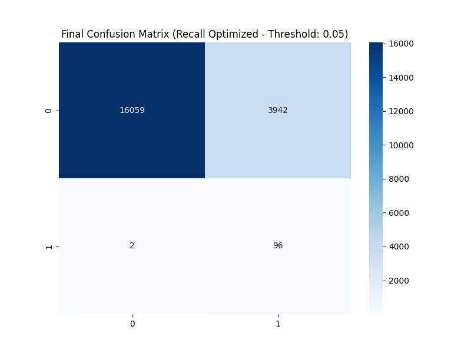

# 💳 Credit Card Fraud Detection: End-to-End Professional Pipeline

Bu proje, Avrupa'daki kart sahiplerinin işlemlerinden oluşan veri seti üzerinde, veri sızıntısını (leakage) engelleyen ve iş odaklı eşik değer (threshold) optimizasyonu yapan profesyonel bir makine öğrenmesi çözümüdür.

## 📖 Detaylı Analiz Raporu
Projenin tüm analiz adımlarına ve detaylı kod açıklamalarına notebook üzerinden ulaşabilirsiniz:
👉 [Fraud Detection Report (Jupyter Notebook)](./notebooks/Fraud_Detection_Report.ipynb)

---

## 📂 Veri Seti Hakkında
Bu çalışmada [Kaggle Credit Card Fraud Detection](https://www.kaggle.com/datasets/mlg-ulb/creditcardfraud) veri seti kullanılmıştır.
- **İçerik:** Eylül 2013'teki Avrupa kart işlemleri.
- **Dengesizlik:** İşlemlerin yalnızca **%0.17'si** dolandırıcılıktır.

---

## 🛠️ Teknik Süreç ve Metodoloji

### 1. Keşifçi Veri Analizi (EDA)
Veri setindeki %0.17'lik fraud oranı, standart modeller için "Accuracy Paradox" yaratır. Bu dengesizliği aşağıdaki görsellerle analiz ettik:

| Sınıf Dağılımı | Zamana Göre Yoğunluk |
|---|---|
|  |  |

### 2. Özellik Mühendisliği (Feature Engineering)
- **Amount_Log:** Harcama tutarlarındaki sapmaları normalleştirmek için kullanıldı.
- **Time_Diff:** İşlemler arası saniye farkı ile "hızlı işlem" kontrolü yapıldı.
- **PCA Stats:** V1-V28 bileşenlerinin merkezi eğilimleri türetildi.

### 3. Sızıntısız Model Hattı (Pipeline)
Veri sızıntısını önlemek için `imblearn.pipeline` kullanılarak Scaling ve SMOTE işlemleri sadece eğitim katmanlarına uygulanmıştır.


[Image of machine learning pipeline diagram]


---

## 📈 Final Performans Sonuçları
Modelimiz dolandırıcılığı kaçırmamak adına **Recall** odaklı optimize edilmiştir. **0.05 Eşik Değeri** ile elde edilen sonuçlar:



- **Doğru Yakalanan Fraud:** 96
- **Gözden Kaçan Fraud (FN):** 2
- **Yakalama Oranı (Recall):** ~%98

---

## 💻 Kurulum ve Çalıştırma
1. Veriyi `data/` klasörüne yerleştirin.
2. Kütüphaneleri kurun:
```bash
pip install -r requirements.txt